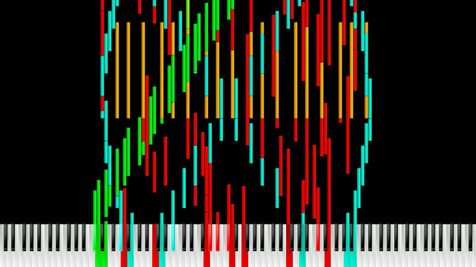
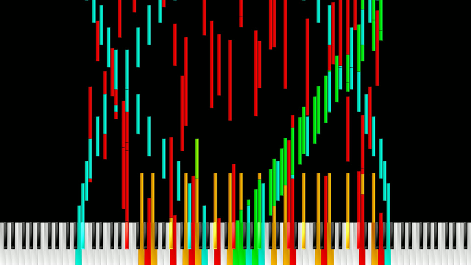
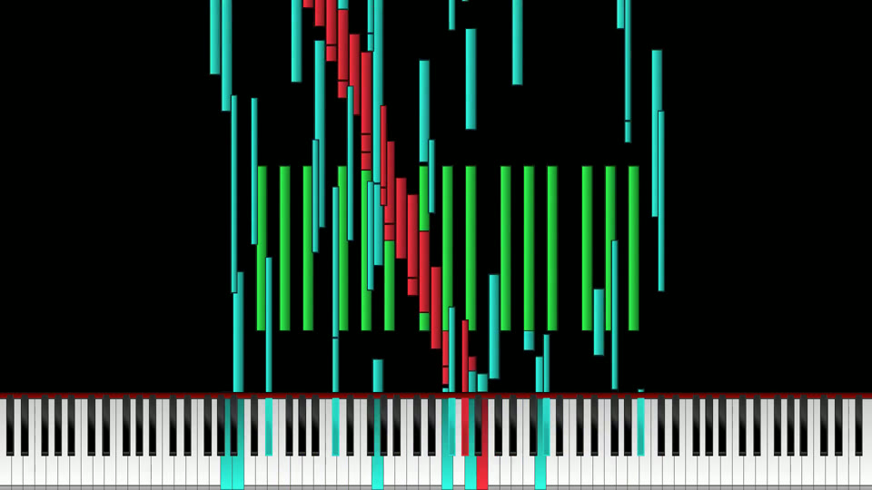
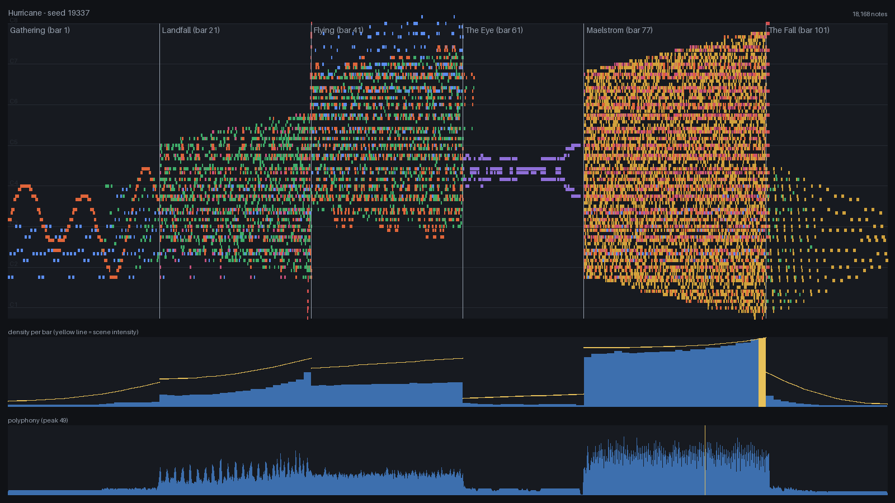

# Agentic MIDI Artist

[](https://github.com/jklutka/agentic-midi-artist/actions/workflows/ci.yml)
[](LICENSE)
[](pyproject.toml)

**Agentic MIDI Artist** is an agent-first **generative performance composer** for creating
visually dramatic MIDI art, rendered with
[Zenith-MIDI](https://github.com/arduano/Zenith-MIDI). The `midi-art` CLI is its engine,
built so an AI agent (or a human) can drive the whole creative process end to end.

The creative object is the *performance* — its structure, pacing, geometry, tension, and
climax. The `.mid` file is just the final serialization stage, deliberately designed for
Zenith's visual behavior rather than generic playback.

```text
Choose a style  →  shape the scene timeline  →  preview  →  compose  →  analyze  →  export  →  render in Zenith
```

## Gallery

Frames captured from Zenith renders of prior performances, alongside the `midi-art preview`
analysis view used to sculpt them before rendering:

<table>
<tr>
<td width="50%"></td>
<td width="50%"></td>
</tr>
<tr>
<td width="50%"></td>
<td width="50%"></td>
</tr>
</table>

## Setup

```powershell
# Create virtual environment
python -m venv .venv
.venv\Scripts\activate

# Install in development mode
pip install -e ".[dev]"
```

### External tools (Zenith, FFmpeg, FluidSynth, SoundFont)

The renderer and audio tools live in **one standard per-user layout** so that every
machine (and every AI agent) can assume where they are — no environment variables needed:

```text
%LOCALAPPDATA%\midi-art\      (override the root with MIDI_ART_HOME)
├── zenith\       Zenith.exe + ffmpeg.exe beside it (Zenith needs it there for video)
├── fluidsynth\   extracted FluidSynth release (bin\fluidsynth.exe)
└── soundfonts\   *.sf2 — default.sf2 wins, else first alphabetically
```

```powershell
midi-art doctor        # what resolves, from where; exit 1 if anything is missing
midi-art setup         # download + install everything missing into the layout
midi-art setup --only fluidsynth,soundfont    # just the audio essentials
```

`setup` fetches Zenith-MIDI and FluidSynth from their GitHub releases, FFmpeg from
gyan.dev, and the [GeneralUser GS](https://schristiancollins.com/generaluser.php)
SoundFont. Tools found elsewhere still win if you prefer custom locations: explicit
flags → env vars (`ZENITH_MIDI_PATH`, `FFMPEG_PATH`, `FLUIDSYNTH_PATH`,
`SOUNDFONT_PATH`) → the standard layout → PATH.

These tools are optional: composing, linting, reporting, PNG preview, and MIDI export work
without them. `midi-art setup` downloads roughly 40–100 MB, so an agent should tell the
user before running it. Zenith's video render is silent; `midi-art audio` synthesizes the
`.mid` into a `.wav` through FluidSynth and can mux it into the Zenith video (both start at
tick 0, so they line up automatically). Dense pieces clip easily — the defaults
(`--gain 0.5`, `--polyphony 1024`) are tuned for that; drop the gain further if the peaks
distort.

## Quick Start

```powershell
# Browse the artistic building blocks
midi-art styles
midi-art generators
midi-art transitions
midi-art profiles

# The complete authoring contract in one command: project schema, brief schema,
# generator param specs, enums — also available as compact JSON with --json
midi-art describe

# Start a performance from a style preset — creates an editable project file
midi-art new "Collapse of the Machine" --style controlled_chaos --seed 82217 -o projects\collapse.json

# Or start from a creative brief (mood arc, imagery, duration — your words, not parameters)
midi-art new "Glass Rain" --brief projects\glass-rain.brief.json -o projects\glass-rain.json

# Validate the document after editing: unknown keys, bad enum values (with
# did-you-mean), out-of-range values, unknown generator params
midi-art lint projects\collapse.json

# Compose the full performance: writes the .mid, a render manifest, and an analysis report
midi-art generate projects\collapse.json

# Iterate fast: compose a single scene instead of the whole performance
midi-art generate projects\collapse.json --scene Fracture

# Generate variations: same structure, different dice
midi-art generate projects\collapse.json --seed 7 --suffix var-b

# Analyze without writing MIDI
midi-art report projects\collapse.json

# Visual preview without rendering in Zenith: piano roll, density + intensity
# curve, polyphony graph, scene boundaries — a standalone HTML file or a PNG image
midi-art preview projects\collapse.json --open
midi-art preview projects\collapse.json --format png

# Compare variations side by side before committing to one
midi-art preview projects\collapse.json --seeds 82217,7,99 --open

# Launch the desktop studio (GUI)
midi-art studio projects\collapse.json     # or: midi-art-studio

# Make the music track: render the .mid to .wav, and mux it into a Zenith video
midi-art audio output\collapse-of-the-machine.mid --soundfont "C:\soundfonts\GeneralUser GS.sf2"
midi-art audio output\collapse-of-the-machine.mid --video renders\collapse.mp4
```

`generate` prints a report (note counts per scene, density, polyphony, pitch range) plus
validation warnings, and writes a `.manifest.json` next to the `.mid` recording the exact
seed, profile, project hash, and creative brief so any output can be regenerated.
`describe`, `new`, `lint`, `generate`, `report`, and `preview` all accept `--json` for
machine-readable output.

An example project is committed at [projects/collapse.json](projects/collapse.json).

## Using with an AI agent

The project is agent-first: an AI coding agent (Claude Code, OpenAI Codex, …) can take
your creative direction and produce the MIDI end to end. [AGENTS.md](AGENTS.md) is the
canonical agent guide — both tools read it — and [docs/COMPOSING.md](docs/COMPOSING.md)
is the creative process it follows:

1. You describe the piece (mood arc, imagery, duration, must-have moments).
2. The agent saves that as a **creative brief** (`projects/<name>.brief.json`) and
   scaffolds a project from it (`midi-art new --brief`).
3. It sculpts the project JSON, checking itself with `midi-art lint --json` and
   `midi-art report --json` after every change.
4. It *looks at* `midi-art preview --format png` to judge the piece against your brief,
   iterates, and delivers the `.mid` plus seed variations.

Claude Code and Codex each discover a repository-scoped `compose-midi-art` skill. Both
skills route to the same canonical guide, while other shell-capable OpenAI agents can use
`midi-art describe --json` as the complete authoring contract.

## The composition model

A **project** is a JSON file you can edit, version, duplicate, and regenerate:

```text
Project                      # name, seed, artistic direction, key/scale/tempo
 └── Scenes (the timeline)   # "Order" → "Fracture" → "Collapse" → "Aftermath"
      ├── SceneIntent        # intensity ramp, register expansion, order↔chaos, stability
      ├── Layers             # independent voices, each with a role and color group
      │    └── Generator     # the plugin that produces this layer's notes
      └── Transition out     # what happens at the boundary with the next scene
```

Artistic controls, not raw parameters: a scene's `intensity` (0..1) maps internally to note
rates, polyphony, velocity ranges, subdivision, and note lengths
([controls.py](src/midi_art/composition/controls.py)). Register bounds expand over a scene.
`order` decides grid-tight vs. chaotic; `harmonic_stability` decides in-key vs. chromatic.

### Generators (plugins)

| Generator | Visual character |
|---|---|
| `pulse` | steady beams — the rhythmic anchor |
| `arpeggio` | rolling broken chords, diagonal motion |
| `cascade` | scale runs sweeping the register — bold diagonals |
| `chord_wall` | chords stacked across octaves — vertical impact walls |
| `cloud` | scattered constellations, chaos that scales with intensity |
| `wave` | sine-shaped sweeps — hypnotic rolling motion |
| `mirror` | a melodic walk reflected around the register center — symmetry |

### Transitions

`density_crossfade` (echoes decay into the next scene), `sudden_silence` (cut to a void),
`keyboard_sweep` (a glissando races into the boundary), `chord_wall_impact` (a full-range
chord lands on the downbeat).

### Style presets

Styles configure the *entire engine* — scenes, layers, curves, transitions, export profile:

- **`mechanical_precision`** — quantized grids, hard symmetry, abrupt transitions
- **`organic_growth`** — curved density growth, expanding register, smooth crossfades
- **`controlled_chaos`** — stability corrupted by chromatic storms into a saturated collapse

### Preview and iteration

The Zenith render-test cycle is slow, so previews are first-class:

- **`midi-art preview`** writes a self-contained HTML page: piano roll colored by channel,
  scene boundaries, density-per-bar with the intensity curve overlaid, and a polyphony graph
  with its peak marked. `--seeds 1,2,3` renders variations side by side; `--scene` previews
  one scene.
- **`midi-art studio`** is the desktop app: a project wizard with a style browser, the scene
  timeline, a scene editor with artistic sliders (intensity, curve, transition), a layer
  inspector (role, generator with visual descriptions, color group, gain), an embedded
  preview canvas, the analysis/warnings panel, seed rerolling, and one-click MIDI export.
  The **Advanced** toggle reveals expert controls: order/harmonic-stability/register
  sliders, export profile selection, and raw generator params (JSON).

### Zenith-aware export

Export profiles (`zenith_standard`, `zenith_high_density`, `zenith_extreme_density`,
`zenith_performance_safe`) set minimum note durations, same-pitch overlap policy (stuck-note
prevention), and runaway-generation caps. Layer `color_group`s are allocated to MIDI channels
so Zenith's channel-to-color mapping becomes an artistic choice; transition notes get their
own reserved channel.

## Using the library directly

```python
from midi_art.presets import build_style
from midi_art.composition.composer import compose
from midi_art.analysis.metrics import analyze
from midi_art.export.midi_writer import write_midi

project = build_style("organic_growth", "My Performance", seed=42)
project.save("projects/my_performance.json")

performance = compose(project)                      # or compose(project, scene_name="Canopy")
print(analyze(performance).format_text())
write_midi(performance.notes, "output/my_performance.mid", performance.settings,
           tempo_events=performance.tempo_events)
```

Everything is deterministic: the same project file and seed always produce byte-identical
MIDI. Each layer draws from its own RNG stream, so editing one layer never reshuffles the
others.

## Project structure

```
agentic-midi-artist/
├── src/midi_art/            # The performance composer (primary package)
│   ├── domain/              # Project, Scene, Layer, NoteEvent, automation curves
│   ├── composition/         # Harmony, artistic-control mapping, the composer
│   ├── generators/          # Note-generator plugins + registry
│   ├── transitions/         # Scene-boundary transition plugins + registry
│   ├── analysis/            # Metrics report + pre-export validation
│   ├── preview/             # Toolkit-independent preview model + SVG/HTML renderer
│   ├── export/              # Zenith profiles, channel allocation, MIDI writer
│   ├── presets/             # Style presets (full project templates)
│   └── app/                 # cli.py (midi-art) and desktop.py (midi-art studio)
├── src/midi_app/            # Legacy generator (kept during migration, see below)
├── projects/                # Project + brief files (.json) — durable, versionable
├── docs/                    # COMPOSING.md — the creative process guide for agents/humans
├── examples/                # Legacy demo scripts
├── tests/                   # test_art_* covers midi_art; older files cover midi_app
├── output/                  # Generated .mid + manifests (gitignored)
└── renders/                 # Zenith video renders (gitignored)
```

## Legacy: midi_app

The original procedural generator is still installed alongside `midi_art` while features
migrate:

- `midi-dense-ui` — the original Tkinter dense-song generator UI
- `python examples/generate_demos.py` — the original pattern demos
- `midi_app.zenith.launch_zenith_preview()` — launch Zenith on a `.mid` file (still the way
  to preview `midi_art` output too)

New work should target `midi_art`.

## Running tests

```powershell
pytest                # full suite
ruff check .          # lint
```

## Roadmap

Implemented: project files · scene timeline · layers · 7 generators (with declared param
specs) · 4 transitions · intensity/register automation · artistic-control mapping · 3 style
presets · Zenith export profiles · channel color groups · analysis + validation · scene-only
preview · variations via seed override · v2 render manifests (project hash, issues, brief
link) · HTML and PNG piano-roll/density/polyphony previews · variation comparison · the
midi-art studio desktop app · the authoring contract (`describe`) · document lint with
did-you-mean (`lint`) · `--json` machine-readable output · compact visual summaries ·
creative briefs (`new --brief`) · agent workflow docs (AGENTS.md, docs/COMPOSING.md).

Next: composition grammar for long-form arrangement, visual-gesture vocabulary as
first-class commands, richer automation targets, retiring the legacy `midi_app` package.
